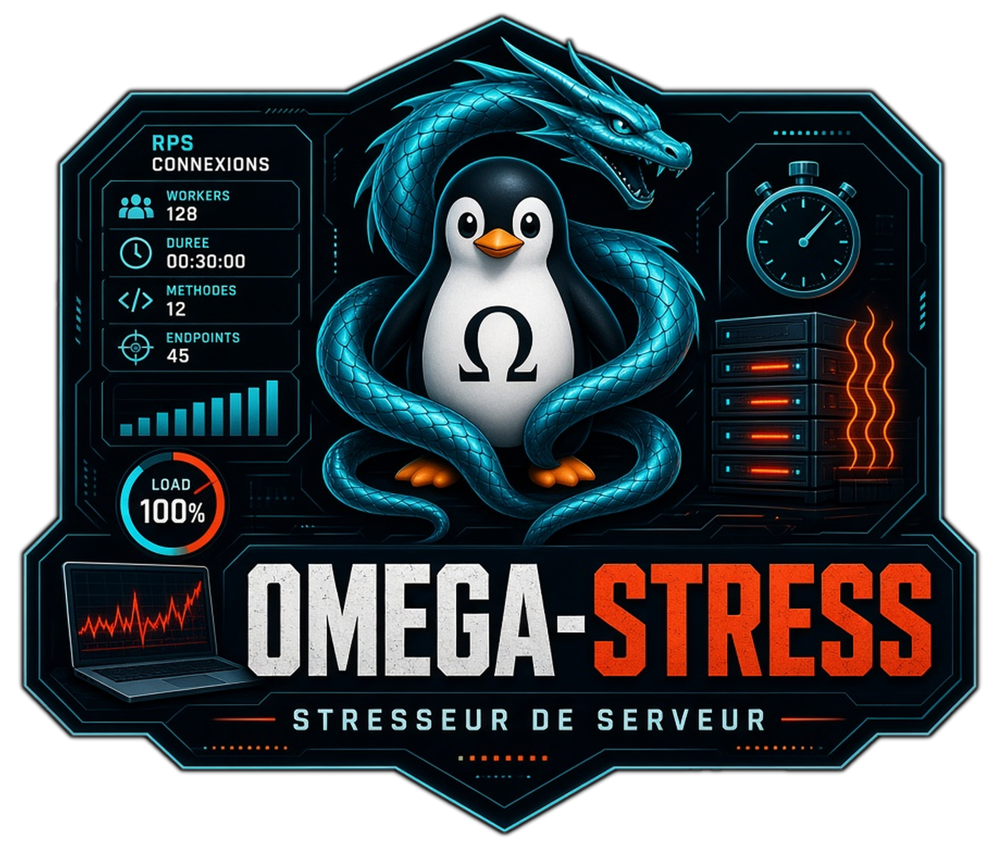

<!-- Copyright (c) 2026 kraynux - kraynux@proton.me - Licence MIT (voir fichier LICENSE) -->
<div align="center">
  
</div>

# 🗲 OMEGA-STRESS

**Poste de test de charge HTTP encadré**

> Élaboré par **kraynux** pour **Omega-server** 
[https://kraynux.snake-mackarel.ts.net](https://kraynux.snake-mackarel.ts.net)

Page officielle : [OMEGA-STRESS](https://kraynux.snake-mackarel.ts.net/omega-stress/) &nbsp; Aperçu : [Screenshots](https://kraynux.snake-mackarel.ts.net/omega-stress/screenshots/)  

[](LICENSE)
[](https://www.python.org/)
[](https://www.linux.org/)
[](https://github.com/Textualize/rich)

**Langues:**  
[Français](README.md) · [English](README.en.md) · [Español](README.es.md) · [Русский](README.ru.md) · [中文](README.zh-CN.md)


**Omega-Stress** est une application locale en terminal (TUI [Textual](https://github.com/Textualize/textual) + CLI scriptable) qui pilote des tests de charge HTTP de manière encadrée et réutilisable : profils figés, historique, relance, exports détaillés (JSON/CSV/HTML), bornes de sécurité explicites.

Le projet est conçu selon les principes de la **Clean Architecture**, avec une séparation claire entre domaine métier, orchestration, infrastructure et interface utilisateur.
---

## Sommaire

- [Présentation](#présentation)
- [Fonctionnalités](#fonctionnalités)
- [Architecture](#architecture)
- [Prérequis](#prérequis)
- [Installation](#installation)
- [Utilisation](#utilisation)
- [Profils de durée D1-D6](#profils-de-durée-d1-d6-mode-profil)
- [Mode sécurité](#mode-sécurité)
- [Calibrage local](#calibrage-local)
- [Configuration](#configuration)
- [Tests et qualité](#tests-et-qualité)
- [Désinstallation](#désinstallation)
- [Limites connues](#limites-connues)
- [Licence](#licence)

## Présentation

### Objectifs

## Ce que fait Omega-Stress (cible V1)

- Trois familles de test encadrées : **Test requêtes** (débit), **Test connexions** (simultanéité), **Test charge** (montée progressive).
- **8 niveaux d'intensité** (Faible/Bas/Moyen/Haut/Puissant/Agressif/Violent/Maximum), avec un modèle de pré-check à 3 paliers (jamais gaté / gaté optionnel / gaté obligatoire — voir [Valeurs des tests](#valeurs-des-tests)).
- **Deux modes de durée** : manuel (1 à 5 min, borné par niveau) ou **profil nommé D1-D6** (durée totale fixe avec warm-up/rampe/plateau/retour au calme — voir [Profils de durée D1-D6](#profils-de-durée-d1-d6-mode-profil)).
- **Mode sécurité** (actif par défaut, désactivable à chaque lancement) : garde-fous locaux CPU/mémoire de la machine hôte, distincts des seuils qui protègent la cible testée — voir [Mode sécurité](#mode-sécurité).
- **Calibrage local persistant** : mesure la capacité réelle de la machine hôte (jamais la cible) via un serveur de boucle locale, par paliers de charge croissante — voir [Calibrage local](#calibrage-local).
- Profils figés, réutilisables, historisés.
- Confirmation d'autorisation explicite obligatoire avant tout run sur une cible non épinglée.
- Seuils d'arrêt automatique, jamais de charge non bornée.
- Exports JSON/CSV/HTML détaillés (paliers, métriques par intervalle, verdict, diagnostic).
- Mode CLI non interactif pour automatisation (cron, CI), appelant exactement les mêmes cas d'usage que le TUI.
- Adaptation automatique au terminal (thème + profil de rendu dégradable).

## Ce que le projet ne fait pas

- Il ne remplace pas un outil de scan réseau — vocabulaire produit et posture assumés « test de charge », jamais « scan ».
- Il n'implémente aucun moteur de charge externe (k6, etc.) — génération native `httpx`/asyncio.
- Il ne démarre aucun run sans bornes ni confirmation d'autorisation.
- Ce n'est pas un outil de charge distribué : la génération tourne sur une seule machine, en un seul processus — voir [Limites connues](#limites-connues).

## Fonctionnalités

- **Trois familles de test**, chacune avec 8 niveaux d'intensité (Faible/Bas/Moyen/Haut/Puissant/Agressif/Violent/Maximum) — voir le tableau [Repères de charge](#valeurs-des-tests) pour les valeurs exactes de chaque niveau.
- **Profils de test figés** : nom, cible, famille, intensité, durée, seuil d'erreur — créés une fois, relancés à l'identique depuis le TUI ou le CLI.
- **Profils de durée nommés D1-D6** (mode « profil »), alternative au mode manuel : une durée totale fixe (1 à 120 min) avec warm-up/rampe/plateau/retour au calme, qui borne aussi les niveaux accessibles — voir [Profils de durée D1-D6](#profils-de-durée-d1-d6-mode-profil).
- **Mode sécurité**, coché par défaut sur chaque écran de lancement : arrête un test si la machine hôte (pas la cible) semble en danger. Désactivable en connaissance de cause, avec un rappel comparant le niveau choisi au dernier calibrage effectué — voir [Mode sécurité](#mode-sécurité).
- **Calibrage local persistant** : mesure ce que la machine peut réellement encaisser (7 paliers de charge croissante contre un serveur de boucle locale intégré), consultable depuis l'écran Calibrage — voir [Calibrage local](#calibrage-local).
- **Cibles épinglées** : une adresse épinglée dispense de recocher l'autorisation à chaque lancement ; les cibles récentes non épinglées restent visibles (10 maximum) sans autorisation implicite.
- **Historique complet** : chaque run est journalisé (verdict, métriques, chronologie par intervalle, mode sécurité utilisé) ; un run lié à un profil figé peut être rejoué à l'identique.
- **Exports détaillés** JSON (données brutes réimportables), CSV (analyse tabulaire) ou HTML (rapport lisible, avec thème au choix parmi les 10 palettes du projet).
- **Pré-check** automatique et obligatoire avant tout test Violent/Maximum, facultatif (mais débloquant des durées supplémentaires) sur Puissant/Agressif, avec fenêtre de validité (24 h).
- **Suivi en direct** d'un test en cours : jauge de progression avec décompte fiable (temps restant calculé directement, jamais estimé), débit/erreurs/latence p95 mis à jour à chaque intervalle, arrêt manuel possible sans quitter l'application.
- **Réglages centralisés** : thème (10 palettes Omega + tous les thèmes Textual intégrés, soit 31 au total via la palette de commandes), profil de rendu (auto ou forcé), dossiers d'export et de capture d'écran, purge des cibles/de l'historique.
- **Aide intégrée** (touche `a`) : raccourcis clavier, description de chaque écran (y compris Calibrage et Mode sécurité), tableau de référence des valeurs de charge et tableau des profils de durée D1-D6.
- **CLI scriptable** (`omega-stress profile|run|history|export|calibrate ...`), exactement les mêmes cas d'usage que le TUI, sortie `--json` disponible pour l'automatisation.
- **Adaptation automatique au terminal** : famille et taille détectées au démarrage, thème et richesse d'affichage ajustés en conséquence (voir [Terminaux pris en charge](#terminaux-pris-en-charge)).

## Architecture

Clean Architecture + Ports & Adapters à 9 paquets (`app/`, `core/`, `domain/`, `application/`, `ports/`, `infrastructure/`, `interfaces/`, `plugins/`, `shared/`).
Détail complet : `ARCHITECTURE.md`.

```text
src/omega_stress/
├── app/              Bootstrap et conteneur d'injection de dépendances (câblage manuel, pas de framework DI)
├── core/             Vocabulaire transverse : énumérations, exceptions racine, Result/Ok/Err, capacités système
├── domain/           Logique métier pure : charge, profils, runs, cibles, thèmes, terminal — sans I/O
├── application/      Orchestration : commands (actions), queries (lectures), pipeline d'exécution (guards/hooks)
├── ports/            Contrats Protocol/ABC attendus par les adaptateurs (repositories, exporters, générateur de charge...)
├── infrastructure/   Implémentations concrètes : SQLite, exporters JSON/CSV/HTML, générateur httpx/asyncio, détection terminal, sonde système
├── interfaces/       Deux adaptateurs de présentation indépendants : TUI (Textual) et CLI (argparse)
├── plugins/          Point d'extension réservé (chargement de plugins) — scaffolding présent, non implémenté en V1
└── shared/           Utilitaires transverses sans dépendance métier (horloge injectable, génération d'identifiants)
```

### Principes de conception

- `domain/` ne contient ni I/O ni dépendance vers l'infrastructure — logique métier pure, entièrement testable sans mock.
- `application/` orchestre les cas d'usage via le domaine et les ports, jamais directement une classe concrète d'`infrastructure/`.
- `infrastructure/` implémente les ports sans jamais être importée directement par `application/` ou `domain/` — seules `interfaces/` et `app/` la référencent.
- `interfaces/` ne doit jamais appeler `infrastructure/` directement ni `subprocess` : uniquement via `application/` (commands/queries) et ses propres controllers.
- `ports/` définit les contrats attendus par les adaptateurs (Protocol), jamais d'implémentation.
- `core/` regroupe le vocabulaire transverse à toutes les couches, sans jamais y encoder de règle métier chiffrée (seuils, durées, presets — toujours dans `domain/*/policies.py`).

La Dependency Rule (couches externes → internes uniquement) et l'isolation des technologies tierces (`textual`, `sqlite3`, `httpx`, `jinja2` chacune cantonnée à son point d'entrée désigné) sont vérifiées automatiquement à chaque exécution de `lint-imports` (voir [Tests et qualité](#tests-et-qualité)).

## Prérequis

- Python ≥ 3.10
- [`uv`](https://github.com/astral-sh/uv) recommandé pour la gestion des dépendances (sinon `pip` standard)

### Système

- Linux, en priorité Arch Linux et distributions compatibles.
- Python 3.10 ou supérieur.
- Aucun privilège root requis : Omega-Stress ne fait que des appels HTTP sortants en tant qu'utilisateur normal.

## Installation

L'archive officielle est fournie au format `.tar.gz`. Vérifiez son intégrité avant installation :

```bash
sha256sum omega-stress.tar.gz
```

### Méthode 1 — script d'installation

```bash
[ -d omega-stress ] && echo "ℹ️ Déjà extrait ici, étape ignorée." || tar -xzf omega-stress.tar.gz
[ -d ~/omega-stress ] && echo "ℹ️ ~/omega-stress existe déjà, déplacement ignoré." || mv omega-stress ~/
cd ~/omega-stress/
chmod +x install.sh
./install.sh
```

### Méthode 2 — installation complète résiliente

Cette commande peut être copiée-collée telle quelle et relancée sans erreur : chaque étape ignore ce qui a déjà été fait.

```bash
( [ -d omega-stress ] || tar -xzf omega-stress.tar.gz ) && \
( [ -d ~/omega-stress ] || mv omega-stress ~/ ) && \
cd ~/omega-stress && chmod +x install.sh && ./install.sh
```
`install.sh` :

1. Crée l'environnement virtuel `.venv` s'il n'existe pas déjà.
2. Installe les dépendances (`pip install -e .`, `pyproject.toml` reste l'unique source de vérité).
3. Rend `omega-stress.sh` et `install.sh` exécutables.
4. Ajoute l'alias `stress` à `~/.bashrc` et `~/.zshrc` (sans doublon si déjà présent).

## Installation (développement)

```bash
uv sync --all-extras
# ou, sans uv :
python -m venv .venv && source .venv/bin/activate
pip install -e ".[dev]"
```


### Lancement

```bash
cd ~/omega-stress
./omega-stress.sh

# ou simplement taper "stress" dans un nouveau terminal si l'alias a été créé
```

Le lanceur :

1. Détecte `.venv`, `venv` ou Python système.
2. Configure `PYTHONPATH` vers `src/`.
3. Lance `python -m omega_stress` — sans argument, ouvre le TUI ; avec un argument, dispatche vers le CLI.

### Utilisation en CLI

```bash
omega-stress profile list                                     # lister les profils
omega-stress profile create --name "Sondage API" --target-id t-1 \
    --family request --level bas --duration-minutes 1 --max-error-rate 0.05
omega-stress profile freeze <profile-id>                       # figer un profil

# Pré-check obligatoire avant tout lancement Violent/Maximum (optionnel sur Puissant/Agressif)
omega-stress run precheck --target-id t-1 --target-url https://exemple.org --confirm

omega-stress run request --target-id t-1 --target-url https://exemple.org \
    --level bas --duration-minutes 1 --max-error-rate 0.05 --confirm
omega-stress run connection --target-id t-1 --target-url https://exemple.org \
    --level moyen --duration-minutes 3 --max-error-rate 0.05 --confirm
omega-stress run ramp --target-id t-1 --target-url https://exemple.org \
    --level puissant --duration-minutes 3 --max-error-rate 0.05 --confirm --precheck-validated

# Mode profil D1-D6, plutôt que --duration-minutes (mutuellement exclusifs)
# D4 (resilience) autorise Agressif sans condition, Violent avec confirmation renforcée
omega-stress run request --target-id t-1 --target-url https://exemple.org \
    --level violent --duration-preset d4 --max-error-rate 0.05 --confirm \
    --precheck-validated --confirmation-text JE_CONFIRME_LA_CIBLE_AUTORISEE

# --unsafe desactive le mode securite (garde-fous locaux CPU/memoire) ; absent par defaut
omega-stress run connection --target-id t-1 --target-url https://exemple.org \
    --level violent --duration-minutes 1 --max-error-rate 0.05 --confirm \
    --precheck-validated --unsafe

omega-stress run replay <run-id> --confirm                     # rejoue un run lié à un profil figé

omega-stress history list                                      # historique des runs
omega-stress history show <run-id>                              # détail d'un run

omega-stress export <run-id> --format html --destination var/exports --theme omega-base

omega-stress calibrate run                                      # lance un calibrage de cette machine
omega-stress calibrate show                                     # affiche le dernier calibrage connu
```

`--confirm` est l'équivalent en ligne de commande de la case d'autorisation du TUI : requis pour toute cible qui n'est pas déjà épinglée-autorisée. `--target-id`/`--target-url` identiques indique une cible manuelle (non épinglée) ; utilisez l'identifiant d'une cible déjà épinglée pour éviter `--confirm` à chaque lancement.

Ajoutez `--json` à `history`/`export`/`calibrate` pour une sortie machine, exploitable en cron/CI.

### Parcours général

1. Au premier lancement, l'accueil propose : Profils, Test requêtes, Test connexions, Test charge, Historique, Cibles, Calibrage, Réglages, Aide.
2. Depuis un écran de test : choisir ou saisir une cible, cocher l'autorisation si la cible n'est pas déjà épinglée-autorisée, régler intensité/durée (manuelle ou profil D1-D6)/seuil d'erreur, laisser le mode sécurité actif ou le désactiver en connaissance de cause, lancer un pré-check si le niveau l'exige, puis lancer le test.
3. Le résultat s'affiche immédiatement (verdict, métriques, chronologie), sans repasser par l'Historique — un export est proposé directement depuis cet écran.
4. Un profil peut être figé pour relancer le même test à l'identique plus tard, depuis l'écran Profils ou en le rejouant depuis l'Historique.

### Valeurs des tests

8 niveaux d'intensité, identiques dans les trois familles de test (seule la dimension pilotée change) — grille complète :

| Type de test | Niveau | Dimension pilotée | Cible visée | Pré-check | Durées disponibles (mode manuel) |
|---|---|---|---|---|---|
| Test requêtes | Faible | Débit | 250 req/min (≈4,2 req/s) | Non | 1 à 5 min |
| Test requêtes | Bas | Débit | 500 req/min (≈8,3 req/s) | Non | 1 à 5 min |
| Test requêtes | Moyen | Débit | 1000 req/min (≈16,7 req/s) | Non | 1 à 5 min |
| Test requêtes | Haut | Débit | 2000 req/min (≈33,3 req/s) | Non | 1 à 5 min |
| Test requêtes | Puissant | Débit | 6000 req/min (≈100 req/s) | Optionnel | 1 à 3 min (5 si pré-check validé) |
| Test requêtes | Agressif | Débit | 10 000 req/min (≈167 req/s) | Optionnel | 1 à 3 min (5 si pré-check validé) |
| Test requêtes | Violent | Débit | 15 000 req/min (≈250 req/s) | **Obligatoire** | 1 à 3 min uniquement |
| Test requêtes | Maximum | Débit | 20 000 req/min (≈333 req/s) | **Obligatoire** | 1 à 3 min uniquement |
| Test connexions | Faible | Connexions simultanées | 25 connexions | Non | 1 à 5 min |
| Test connexions | Bas | Connexions simultanées | 50 connexions | Non | 1 à 5 min |
| Test connexions | Moyen | Connexions simultanées | 100 connexions | Non | 1 à 5 min |
| Test connexions | Haut | Connexions simultanées | 200 connexions | Non | 1 à 5 min |
| Test connexions | Puissant | Connexions simultanées | 1000 connexions | Optionnel | 1 à 3 min (5 si pré-check validé) |
| Test connexions | Agressif | Connexions simultanées | 2000 connexions | Optionnel | 1 à 3 min (5 si pré-check validé) |
| Test connexions | Violent | Connexions simultanées | 3500 connexions | **Obligatoire** | 1 à 3 min uniquement |
| Test connexions | Maximum | Connexions simultanées | 5000 connexions | **Obligatoire** | 1 à 3 min uniquement |
| Test charge (montée progressive) | Faible | Débit, en rampe | pic 250 req/min | Non | 1 à 5 min |
| Test charge (montée progressive) | Bas | Débit, en rampe | pic 500 req/min | Non | 1 à 5 min |
| Test charge (montée progressive) | Moyen | Débit, en rampe | pic 1000 req/min | Non | 1 à 5 min |
| Test charge (montée progressive) | Haut | Débit, en rampe | pic 2000 req/min | Non | 1 à 5 min |
| Test charge (montée progressive) | Puissant | Débit, en rampe | pic 6000 req/min | Optionnel | 1 à 3 min (5 si pré-check validé) |
| Test charge (montée progressive) | Agressif | Débit, en rampe | pic 10 000 req/min | Optionnel | 1 à 3 min (5 si pré-check validé) |
| Test charge (montée progressive) | Violent | Débit, en rampe | pic 15 000 req/min | **Obligatoire** | 1 à 3 min uniquement |
| Test charge (montée progressive) | Maximum | Débit, en rampe | pic 20 000 req/min | **Obligatoire** | 1 à 3 min uniquement |

- **Pré-check Non** : le test démarre directement, sans condition de durée.
- **Pré-check Optionnel** (Puissant/Agressif) : le test démarre sans pré-check (durées 1-3 min), mais un pré-check validé débloque aussi les durées 4-5 min.
- **Pré-check Obligatoire** (Violent/Maximum) : le test ne démarre pas sans un pré-check validé au préalable ; la durée reste plafonnée à 3 min même avec pré-check (le pré-check conditionne ici l'accès au niveau, pas une durée étendue).

La colonne « Durées disponibles » ci-dessus ne couvre que le **mode manuel** (1 à 5 min maximum). Au-delà, seul le [mode profil D1-D6](#profils-de-durée-d1-d6-mode-profil) permet des tests plus longs (jusqu'à 120 min) — chaque profil D1-D6 fixe lui-même quels niveaux restent accessibles à cette durée (`free_max_level`/`reinforced_level`, voir son propre tableau) :

| Niveau | Durée max en mode manuel | Durée max via un profil D1-D6 |
|---|---|---|
| Faible / Bas / Moyen / Haut | 5 min | 120 min (D6, Connexions/Charge uniquement) ; 60 min sur Requêtes (D5, D6 non compatible avec cette famille) |
| Puissant | 5 min (3 min sans pré-check) | 120 min avec confirmation renforcée (D6, Connexions/Charge) ou 60 min sans (D5) |
| Agressif | 5 min (3 min sans pré-check) | 60 min avec confirmation renforcée (D5) ou 30 min sans (D4) |
| Violent | 3 min (pré-check obligatoire) | 30 min avec confirmation renforcée (D4) ou 15 min sans (D3) |
| Maximum | 3 min (pré-check obligatoire) | 5 min maximum (D1/D2 seulement — aucun profil D3-D6 ne propose Maximum, même avec confirmation) |

Ce même tableau est disponible directement dans l'application (Aide → Repères de charge), toujours généré depuis les mêmes valeurs de référence (`domain/load/presets.py`, `domain/load/policies.py`) — jamais dupliqué manuellement.

> Sur Test charge en **mode manuel**, la rampe et le plateau sont automatiquement mis à l'échelle de la durée choisie (proportions du preset conservées) : un test de 1 min explore toute la courbe, de 0 au pic, pas seulement son tout début. En **mode profil D1-D6**, la même garantie est assurée nativement par le découpage warm-up/rampe/plateau/retour au calme de chaque profil — voir [Profils de durée D1-D6](#profils-de-durée-d1-d6-mode-profil).

### Navigation

- Flèches haut/bas : déplacer le curseur.
- `Tab` / `Maj+Tab` : naviguer entre les champs d'un formulaire.
- `Échap` : revenir en arrière (confirmation de sortie depuis l'accueil).
- `a` : afficher l'aide.
- `t` : changer de thème.
- `q` : quitter (avec confirmation).
- `r` : rafraîchit l'affichage, utile après un redimensionnement de terminal.
- `Ctrl+P` : palette de commandes (changer de thème, capture d'écran, aide des raccourcis).

Basculez entre les thèmes avec `t` : Omega-Stress adapte automatiquement les couleurs et la richesse d'affichage aux capacités détectées du terminal, depuis n'importe quel écran. Depuis la palette de commandes (`Ctrl+P` → Thème), les 31 thèmes disponibles sont proposés (10 thèmes Omega + 21 thèmes intégrés à Textual).

### Terminaux pris en charge

Quatre profils de rendu, du plus riche au plus dégradé : **Complet**, **Standard**, **Réduit**, **Mono**. Le profil retenu est le plus restrictif entre la famille de terminal détectée et la taille réelle de la fenêtre (jamais plus riche que l'un des deux plafonds).

| Terminal | Profil par défaut |
|---|---|
| Ghostty, Alacritty, WezTerm, Kitty | Complet |
| Konsole, GNOME Terminal, Terminator, xfce4-terminal | Standard |
| urxvt, xterm | Réduit |
| Linux TTY | Mono |
| SSH (couleur vraie/256 couleurs détectées) | Réduit |
| SSH (signal minimal) | Mono |
| Terminal non reconnu | Réduit (repli prudent) |

En dessous de 80 colonnes × 24 lignes, un écran d'avertissement s'affiche avant l'accueil (jamais bloquant : l'application reste utilisable, en mode dégradé). Konsole, GNOME Terminal et Terminator sont reconnus via leur propre variable d'environnement caractéristique (`KONSOLE_VERSION`, `GNOME_TERMINAL_SCREEN`/`GNOME_TERMINAL_SERVICE`, `TERMINATOR_UUID`) plutôt que `TERM`, qu'ils laissent à sa valeur générique de compatibilité — xfce4-terminal ne pose aucun marqueur équivalent connu à ce jour et se replie donc sur ce même profil Standard uniquement s'il expose une valeur `TERM`/`TERM_PROGRAM` reconnaissable, Réduit sinon.

### Chemins internes et chemins système

Par défaut, Omega-Stress travaille dans son propre dossier `var/`, relatif au répertoire depuis lequel il est lancé (ou `$OMEGA_STRESS_VAR_DIR` s'il est défini) :

```text
var/db/app.db           # base SQLite (profils, cibles, historique)
var/settings.json       # réglages persistés (thème, profil de rendu, dossiers par défaut)
var/exports/            # exports JSON/CSV/HTML par défaut
var/screenshots/        # captures d'écran SVG par défaut (palette de commandes)
var/audit.jsonl         # journal d'audit (une ligne par run)
var/app.log             # journal applicatif
```

Un chemin absolu système (ex. `/var/exports/`) n'est jamais utilisé par défaut — le `/` initial est donc significatif : seul un export explicite vers un dossier choisi par l'utilisateur (Réglages ou écran Export) en sort.

## Profils de durée D1-D6 (mode profil)

Alternative au mode manuel (durée 1-5 min bornée par niveau) : un **profil de durée nommé**, avec une durée totale fixe et un découpage interne en 4 phases (warm-up, rampe, plateau, retour au calme). Sélectionnable sur chaque écran de lancement (bascule « Mode durée : Manuel / Profil D1-D6 ») et en CLI via `--duration-preset`.

| Profil | Durée totale | Warm-up | Rampe | Plateau | Retour au calme | Niveau max sans confirmation | Niveau supplémentaire (confirmation renforcée) | Familles compatibles |
|---|---|---|---|---|---|---|---|---|
| D1 (quick) | 1 min | 5 s | 10 s | 40 s | 5 s | Maximum | — | Requêtes, Connexions, Charge |
| D2 (short) | 5 min | 15 s | 30 s | 4 min | 15 s | Maximum | — | Requêtes, Connexions, Charge |
| D3 (standard) | 15 min | 30 s | 1 min 30 | 12 min 30 | 30 s | Violent | — | Requêtes, Connexions, Charge |
| D4 (resilience) | 30 min | 1 min | 3 min | 25 min | 1 min | Agressif | Violent | Requêtes, Connexions, Charge |
| D5 (extended) | 60 min | 2 min | 5 min | 51 min | 2 min | Puissant | Agressif | Requêtes, Connexions, Charge |
| D6 (soak) | 120 min | 3 min | 10 min | 104 min | 3 min | Haut | Puissant | Connexions, Charge (jamais Requêtes) |

- Le niveau « supplémentaire » (D4-D6) n'est accessible qu'en saisissant exactement le texte de confirmation renforcée affiché à l'écran — jamais une simple case à cocher.
- D6 exclut Test requêtes : un test de débit se borne en volume, jamais pertinent sur un profil de 2 h axé sur la dérive dans le temps.
- Ce même tableau est disponible dans l'application (Aide → Profils de durée D1-D6).

## Mode sécurité

Une case à cocher, présente sur chaque écran de lancement (cochée par défaut), qui bascule **uniquement** les garde-fous qui protègent la machine qui exécute Omega-Stress (CPU/mémoire du générateur local) :

- **Toujours actifs, quel que soit ce réglage** : les seuils qui protègent la **cible testée** (taux d'erreur, latence) — les désactiver n'a jamais de sens produit, ce n'est pas ce que cette case couvre.
- **Mode sécurité actif (par défaut)** : un test s'arrête automatiquement si la machine hôte elle-même semble sous pression (CPU du générateur ET CPU global de la machine élevés en même temps, pas l'un des deux isolément — une saturation normale d'un seul cœur ne suffit jamais à elle seule).
- **Mode sécurité désactivé** : ce garde-fou local est retiré. Un rappel s'affiche alors, comparant le niveau choisi au dernier calibrage connu pour cette machine (voir [Calibrage local](#calibrage-local)) — dépasser cette enveloppe reste possible, mais la fiabilité du résultat et la stabilité de la machine deviennent la responsabilité de l'utilisateur.

Disponible aussi en CLI via `--unsafe` (absent par défaut = mode sécurité actif).

## Calibrage local

Mesure la capacité réelle de **cette machine** (jamais la cible testée) : un serveur de boucle locale intégré à Omega-Stress reçoit une charge croissante par paliers, générée par le même moteur `httpx`/asyncio que les tests réels.

- 7 paliers, du repos (bruit de fond système) jusqu'à 2000 connexions / 12 000 req/s, chacun évalué contre des seuils de santé (CPU générateur ET global, mémoire disponible, taux d'erreur, débit atteint) — les 2 derniers paliers sont conditionnels, sautés si le palier précédent n'est pas sain.
- Produit une enveloppe sûre (`VU_safe` / `RPS_safe`) à partir du dernier palier sain, avec une marge de sécurité (~30 % de réserve) et un niveau de confiance croissant selon la profondeur atteinte.
- **Mesure seule en V1** : le résultat n'est pas appliqué automatiquement pour plafonner un test réel — il sert de repère informatif, notamment quand le [Mode sécurité](#mode-sécurité) est désactivé.
- Persisté par machine (empreinte non invasive : OS/architecture/nombre de cœurs/RAM, jamais d'adresse matérielle), consultable à tout moment sans relancer de mesure.

Accessible depuis l'écran **Calibrage** du TUI (bouton « Lancer le calibrage », progression affichée seconde par seconde), ou en CLI :

```bash
omega-stress calibrate run     # lance un nouveau calibrage
omega-stress calibrate show    # affiche le dernier calibrage connu, sans en relancer un
```

## Configuration

Tout se règle depuis l'écran **Réglages** du TUI (aucun fichier de configuration à éditer à la main) :

- **Thème** : un choix parmi les 10 thèmes Omega, appliqué immédiatement et persisté.
- **Profil de rendu** : Automatique (détection au démarrage) ou forcé manuellement (Complet/Standard/Réduit/Mono).
- **Dossier d'export par défaut** : pré-remplit le champ « destination » de l'écran Export.
- **Dossier des captures d'écran par défaut** : utilisé par la commande « Capture d'écran » de la palette (`Ctrl+P`).
- **Purges** : cibles récentes (jamais les épinglées), toutes les cibles (y compris épinglées et leurs autorisations), ou historique complet — chacune protégée par une confirmation dédiée.

Les réglages sont persistés dans `var/settings.json`. La racine `var/` elle-même peut être redirigée via la variable d'environnement `OMEGA_STRESS_VAR_DIR` (utile pour isoler plusieurs instances, ou pour les tests).

## Tests et qualité

```bash
pytest
ruff check .
mypy src
lint-imports   # vérifie la Dependency Rule (voir pyproject.toml [tool.importlinter])
```

La suite couvre plus de 570 tests (unitaires, intégration, TUI, CLI). `lint-imports` fait échouer la CI si la Dependency Rule ou l'isolation des technologies tierces est violée — voir [Architecture](#architecture).

## Désinstallation

Omega-Stress ne touche à rien en dehors de son propre dossier et d'une ligne d'alias optionnelle :

```bash
rm -rf ~/omega-stress
sed -i '/alias stress=/d' ~/.bashrc ~/.zshrc
```

Aucun paquet système, service, ni fichier hors de `~/omega-stress/` n'est créé par `install.sh` — pas de désinstallation supplémentaire nécessaire.

## Limites connues

- Génération de charge **in-process**, sur une seule machine (`httpx`/asyncio) : ce n'est pas un outil distribué — les plafonds réels (voir [Valeurs des tests](#valeurs-des-tests)) sont nettement plus modestes qu'un service de test de charge SaaS (loader.io, etc.), volontairement, par posture produit encadrée. Sur du matériel modeste, les niveaux Agressif/Violent/Maximum en Test connexions peuvent prendre nettement plus de temps réel que la durée sélectionnée pour émettre la totalité de la charge visée — c'est la capacité de **cette machine**, pas celle de la cible, qui limite alors le débit réel ; utilisez le [Calibrage local](#calibrage-local) pour connaître les valeurs raisonnables sur votre matériel.
- La détection automatique de famille de terminal repose sur des variables d'environnement : xfce4-terminal n'a pas de marqueur fiable connu à ce jour (voir [Terminaux pris en charge](#terminaux-pris-en-charge)).
- `plugins/` est un point d'extension prévu par l'architecture (chargement de plugins builtin/externes), non implémenté en V1 : le scaffolding existe, aucun plugin n'est livré.
- `var/` est relatif au dossier du projet (pas XDG) : pensé pour un usage local mono-utilisateur, pas pour un partage multi-utilisateur sur la même machine.
- Test charge (montée progressive) en **mode manuel** ne comporte pas de palier de redescente (« cooldown ») après le plateau — uniquement disponible via un [profil de durée D1-D6](#profils-de-durée-d1-d6-mode-profil), qui inclut les 4 phases nativement.
- Un pré-check validé n'est pas lié à une cible précise : il reste valable 24 h pour n'importe quel lancement Violent/Maximum suivant, pas uniquement sur la cible pré-checkée.
- Le [Calibrage local](#calibrage-local) mesure, mais n'applique pas encore automatiquement son enveloppe sûre pour plafonner un test réel — un chantier délibérément distinct, non commencé.

## Licence

MIT — voir `LICENSE`.
